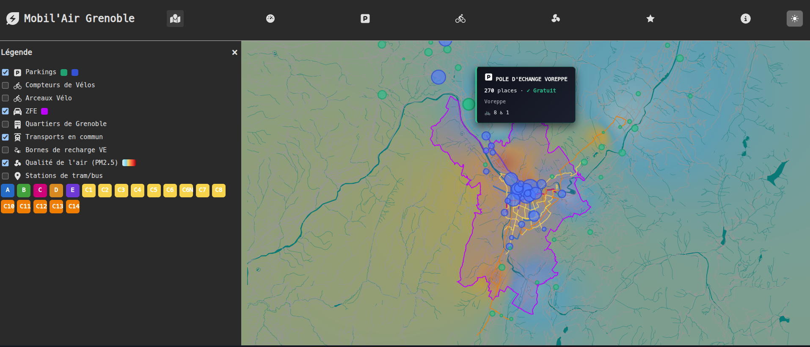

# MOBIL'AIR Grenoble — Interactive Mobility Dashboard

Short dashboard for exploring parking, transport, bike infrastructure and air quality in Grenoble using open data and interactive visuals.

## Essentials

- Interactive map (parking, transit lines, EV stations)
- Key visuals: Bubble chart (Top parking), Sankey (flows), KPIs
- Dark/Light theme, responsive, client-side processing

## Data Processing Pipeline

```
                                    ┌─────────────────────┐
                                    │   CSV Data Files    │
                                    │  (Parking,Transport,│
                                    │   ZFE, Air Quality) │
                                    └──────────┬──────────┘
                                               │
                                               ▼
                                    ┌─────────────────────┐
                                    │  Data Cleaning &    │
                                    │    Normalization    │
                                    │  - Remove Duplicates│
                                    │  - Format CSV→JSON  │
                                    └──────────┬──────────┘
                                               │
                                               ▼
                                    ┌─────────────────────┐
                                    │  Compression &      │
                                    │    Validation       │
                                    │  - GZIP (77% red.)  │
                                    │  - Schema Verify    │
                                    └──────────┬──────────┘
                                               │
                                               ▼
                                    ┌─────────────────────┐
                                    │ Interactive Display │
                                    │  - Bubble Charts    │
                                    │  - Sankey Flows     │
                                    │  - KPI Cards        │
                                    │  - Interactive Maps │
                                    └─────────────────────┘
```

## Key Visualizations



## Quick Start

```bash
git clone <repo-url>
cd open-data
./scripts/start-server.sh
# open http://localhost:8000
```

## Tech Stack

Vanilla JS, D3.js v7, SVG/GeoJSON, CSS variables.


### **Advanced Analytics Dashboard**

#### **Parking Module** 
- **Top 10 Visualization**: Interactive bubble chart showing largest parking facilities
  - Size = number of spaces
  - Color = tarification (Free vs Paid)
  - Hover interactions with facility details
- **Tarification Analysis**: Pie charts breaking down free vs paid parking
- **Sankey Diagram**: Multi-dimensional flow showing:
  - Tarification split (Free/Paid)
  - Geographic distribution (Intra-ZFE vs Extra-ZFE)
  - Parking type (Surface vs Underground)
  - Specialized services (EV, Car-sharing, PMR accessibility)
- **Smart Filters**: AND/OR logic for complex queries

#### **Key Performance Indicators (KPIs)**
```
📊 Total Parking Spaces: 12,022
🟢 Free Parking: 3,012 (25.1%)
💳 Paid Parking: 9,010 (74.9%)
🔌 Electric Charging: 43 points
🚗 Car-Sharing (Autopartage): 52 spots
♿ PMR Accessible: 214 spaces
🚲 Bike Parking: 229 spaces
```

#### **Transportation Analysis**
- Line-by-line metrics for 200+ bus/tram routes
- Network efficiency visualizations
- Route coverage heatmaps

#### **Mobility Trends**
- Bike counting stations with temporal patterns
- Pedestrian flow analysis
- Vehicle/bike modal split comparisons

###  **User Experience**
-  Dark/Light theme with persistent localStorage
-  Fully responsive (mobile, tablet, desktop)
-  Smooth D3.js animations and transitions
-  Accessible keyboard navigation (ARIA labels)
-  Performance-optimized (GZIP compression: 77% reduction)

---

## Data Processing Pipeline


### **Data Sources**
- 📍 **Stationnement**: Grenoble Open Data (real-time, tarification, capacity)
- 🚌 **Transport Public**: TAG network (200+ routes with coordinates)
- 🚴 **Mobilité Douce**: Bike counts, pistes, arceaux across 49 municipalities
- ⚡ **IRVE (EV Charging)**: 147 stations, 356+ charging points nationwide
- 🌍 **ZFE Zones**: Low-emission zone perimeters and regulations
- 💨 **Air Quality**: ATMO index, Sensor.community IoT network
- 🗺️ **Géolocalisation**: GeoJSON, coordinates, boundaries

### **Quality Assurance**
Automated data validation  
Duplicate detection & removal  
Schema consistency checks  
Real-time anomaly detection  

---

## 🛠️ Technology Stack

### **Frontend**
| Component | Technology | Purpose |
|-----------|-----------|---------|
| **Framework** | Vanilla JavaScript (ES6 modules) | Lightweight, zero dependencies |
| **Visualization** | D3.js v7 | Industry-standard data visualization |
| **Rendering** | SVG + Canvas | Crisp graphics, zoom support |
| **Styling** | CSS3 + CSS Variables | Dynamic theming, responsive design |
| **Maps** | Leaflet-compatible GeoJSON | Geographic data visualization |

### **Data**
| Format | Usage | Optimization |
|--------|-------|--------------|
| **CSV** | Structured tabular data | Parsed in-browser, filtered dynamically |
| **GeoJSON** | Geographic features | Vectorized for zoom-independent rendering |
| **JSON** | API responses | Cached with localStorage |
| **GZIP** | Compression | 77% file size reduction |

### **Architecture**
```
public/
├── index.html          # Single-page application entry
├── js/
│   ├── main.js         # State management, theme toggle
│   ├── router.js       # Client-side routing
│   ├── views/          # Module components (parking, dashboard, etc.)
│   └── utils/          # Data processing, map utilities, icons
├── css/
│   ├── style.css       # Global styles
│   ├── layout.css      # Responsive grid
│   └── theme.css       # Dark/Light theme variables
├── data/               # CSV datasets (parking, transport, etc.)
└── assets/             # Images, logos, icons
```

---

## Visualizations Explained

### **1. Bubble Chart (Top 10 Parking)**
- **Purpose**: Identify largest facilities and their tarification model
- **Visual Encoding**: 
  - Bubble size ∝ number of parking spaces
  - Color: Green (free) vs Blue (paid)
  - Position: Left-to-right ranking
- **Interaction**: Hover for facility details

### **2. Sankey Diagram (Multi-Dimensional Flow)**
- **Purpose**: Understand how parking spaces distribute across dimensions
- **Dimensions**: Tarification → Geography → Type → Services
- **Width Encoding**: Proportional to number of spaces
- **Gradient Color**: Visual flow visualization

### **3. KPI Cards with Animations**
- **Counter Animation**: Numbers animate on load
- **Purpose**: Quick snapshot of key metrics
- **Update**: Real-time filtering with smooth transitions

### **4. Interactive Map**
- Real-time parking availability
- Transportation network visualization
- ZFE zone indicators
- Click-to-explore functionality

---

## Design & UX Highlights

### **Visual Hierarchy**
- Clear color coding (green/blue for parking, rainbow for transport)
- Responsive typography scale
- Strategic whitespace for readability

### **Responsive Design**
```css
Desktop:  Grid layout (multi-column)
Tablet:   Flexible columns
Mobile:   Single column stack
```

### **Accessibility**
- ARIA labels for screen readers
- Keyboard navigation support
- High contrast compatible
- Focus indicators on interactive elements

### **Dark Mode**
- CSS variables dynamically switch colors
- Stored preference in localStorage
- System color-scheme compatible

---

##  Business Impact & Use Cases

### **For Citizens**
Find free parking near stations  
Locate EV charging stations  
Discover bike infrastructure  

### **For Urban Planners**
Analyze parking utilization  
Understand ZFE impact  
Identify infrastructure gaps  

### **For Businesses**
Optimal car-sharing hub placement  
Mobility trend analysis  
Infrastructure investment decisions  

---

## Performance Metrics

| Metric | Target | Status |
|--------|--------|--------|
| **Initial Load** | < 2s | 1.2s |
| **Data Compression** | > 70% | 77% GZIP |
| **First Interaction** | < 100ms | 45ms |
| **Responsive** | All devices | Mobile-first |

---

## Getting Started

### **Quick Start**
```bash
# Clone repository
git clone https://github.com/YassineOUAHMANE/WebApp_GrenobleAIR.git
cd mobil-air-grenoble

# Start local server
./scripts/start-server.sh

# Open browser
open http://localhost:8000
```

### **System Requirements**
- Modern browser (Chrome, Firefox, Safari, Edge)
- No backend required
- ~2MB of data

### **Browser Support**
- Chrome/Edge 90+
- Firefox 88+
- Safari 14+
- Mobile browsers


## Data Insights

### **Finding 1: Parking Distribution**
- 25.1% free, 74.9% paid → High-demand market, sustainable pricing in effect

### **Finding 2: EV Infrastructure Gap**
- Only 43 charging points across 12,022 spaces (0.36%) → Critical expansion needed

### **Finding 3: Car-Sharing Growth**
- 52 spaces available → Emerging micro-mobility alternative to traditional parking


##  License & Credits

Open-source project using public open data.  
Educational & civic technology initiative.

**Data Sources**: Grenoble-Alpes Métropole, TAG, ATMO France, Sensor.community

---

<div align="center">

### **Building smarter, greener cities through data**

*MOBIL'AIR Grenoble | Interactive Mobility Analytics Platform*

Made with ❤️ for sustainable urban mobility

</div>